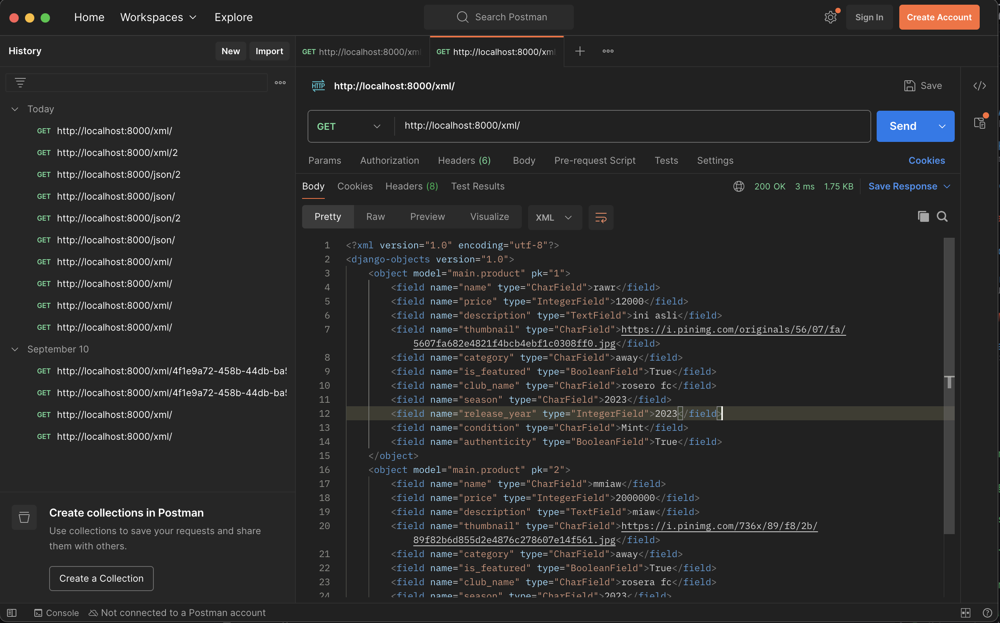
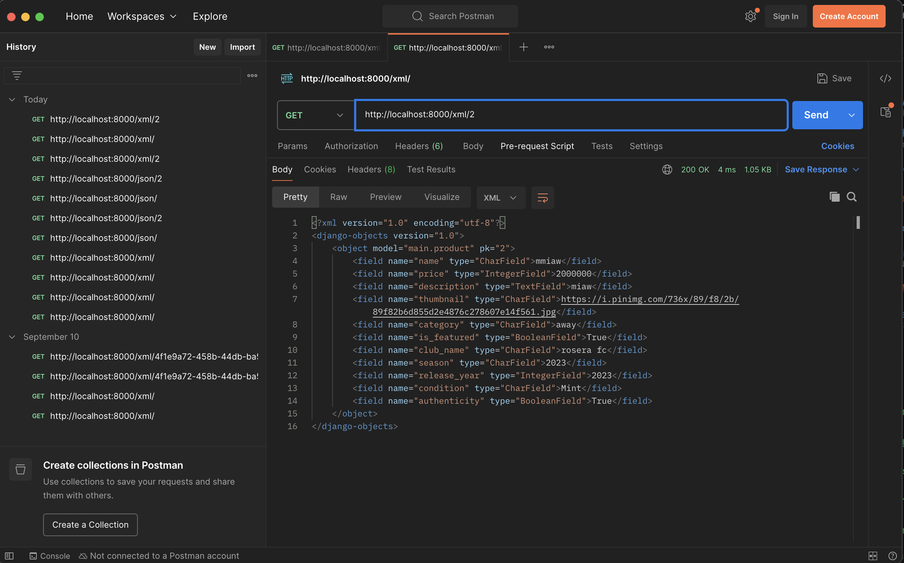
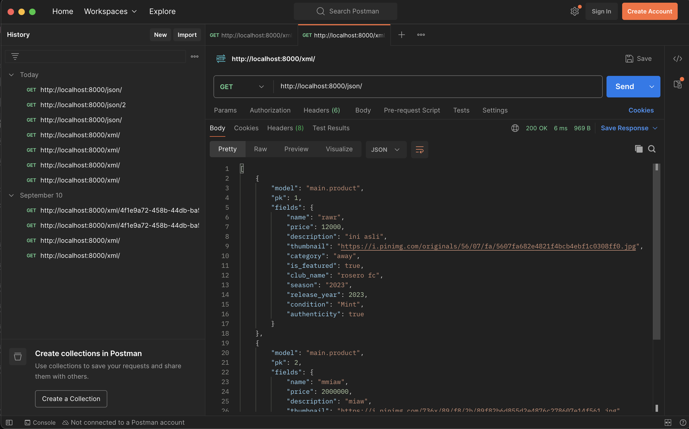
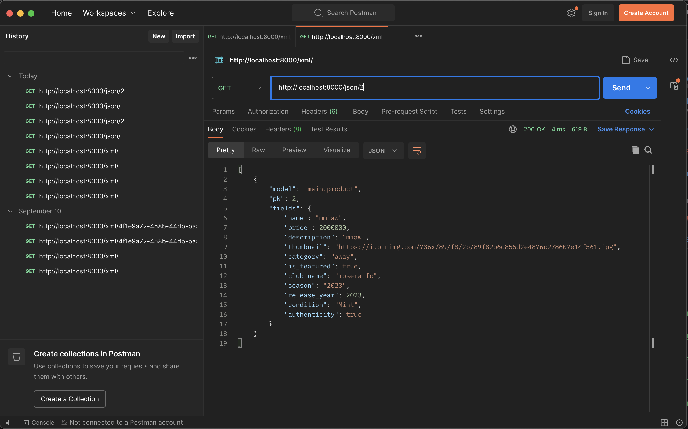

Nama: Raqilla Al-Abrar
NPM: 2406496025
Kelas: A

Link PWS: https://raqilla-alabrar-gollective.pbp.cs.ui.ac.id/

##TUGAS2##
Step by step implementasi checklist:
    1. Inisiasi pembuatan projek Django
       Membuat project baru bernama 'gollective' menggunakan 'django-admin startproject gollective .'
    2. Membuat aplikasi main
       Menggunakan perintah 'python manage.py startapp main', lalu menambahkan 'main' ke INSTALLED_APPS yang berada di settings.py
    3. Membuat model Products
       Pada main/models.py saya membuat model Product dengan field wajib (name, price, description, thumbnail, category, is_featured). Selain itu saya juga menambahkan field tambahan
       club_name -> nama club dari jersey (CharField)
       season -> musim jersey (CharField)
       release_year -> tahun rolis jersey (IntegerField)
       condition -> kondisi jersey (CharField, dengan default = mint)
       authenticity -> status keaslian dari jersey (BooleanField, dengan default = true)

       setelah itu saya menjalankan migration dengan menjalankan:
       python manage.py makemigrations
       python manage.py migrate
    4. Membuat view dan template:
       views.py: membuat fungsi show_main untuk mengirim context
       templates/main.html: menampilkan context yang sudah dibuat pada views.py
    5. Routing url
       main/urls.py: menambahkan path untuk fungsi show_main.
       gollective/urls.py: menambahkan include('main.urls') agar root URL diarahkan ke app main.
    6. Testing lokal dan deploy ke pws
       Setelah melakukan semua pembuatan diatas saya melakukan testing pada lokal server terlebih dahulu untuk cek apakah ada kesalahan menggunakan python manage.py runserver. Lalu jika tidak terjadi kesalahn baru saya deploy ke pws.

Bagan request client ke web aplikasi berbasis Django:
    
    1. Client
        User membuka url di browser. Request dari client tersebut akan dikirim ke server Django
    2. urls.py (Project -> app)
        Pertama Django akan cek urls.py pada gollective/urls.py, lalu request akan diarahkan ke main/urls.py, urls.py berfungsi untuk memetakan URL ke view yang sesuai.
    3. views.py
        Setelah URL dicocokan, fungsi apda views.py akan dijalankan. Views berperan sebagai jembatan antara data (model) dan tampilan (template).
    4. models.py <-> databse
        models.py adalah representasi data dalam bentuk Python class. Model akan berkomunikasi dengan database untuk mengambil atau menyimpan data.
    5. templates (HTML)
        Setelah model mendapatkan data, view akan mengirim data tersebut dalam bentuk context ke file template. Template akan mengatur bagaimana data akan ditampilkan ke user.
    6. Response kembali ke client
        Template dirender menjadi HTML. Django mengirim HTML tersebut sebagai response ke browser. Browser akan menampilkan tampilan halaman web yang sudah berisi beragam data dari database.

Peran settings.py
    settings.py adalah ousat konfigurasi dari Django
    INSTALLED_APPS: daftar aplikasi yang digunakan
    DATABASES: konfigurasi database
    MIDDLEWARE: middleware untuk request atau response
    TEMPLATE: pengaturan engine template Django
    ALLOWED HOST: untuk keamanan dan deployment aplikasi
    STATICFILES: konfugrasi file statis seperti CSS, JS, gambar

Cara kerja migrasi
    python manage.py makemigrations → membuat file migrasi dari perubahan model.
    python manage.py migrate → mengeksekusi file migrasi tersebut agar database sinkron dengan model.
    Migrasi memastikan struktur database selalu sesuai dengan definisi model di Python.

Django dipilih sebagai framework awal karena beberapa alasan berikut:
    1. Konsep MVT yabg mudah dipahami untuk belajar alur web app
    2. Fitur bawaan lengkap seperti ORM, auth, admin, form, dan lain-lain
    3. Dokumentasi Django sudah sangat baik sehingga memudahkan mahasiswa untuk belajar mandiri

Feedback: Sejauh ini sudah sangat baik, asdosnya juga keren banget, sangat amat membantu.

##TUGAS3##
Mengapa perlu data delivery?
    Data delivery dibutuhkan supaya aplikasi bisa saling bertukar data, baik antar sistem maupun antar platform. Misalnya backend Django bisa memberikan data JSON ke aplikasi mobile, atau menyediakan XML untuk integrasi dengan sistem lain. Tanpa data delivery, aplikasi hanya bisa menampilkan HTML ke user dan sulit diintegrasikan.
Mana yang lebih baik JSON atau XML? Kenapa JSON lebih populer
    Secara umum JSON lebih baik untuk kebutuhan modern karena lebih ringan, mudah dibaca manusia, dan lebih efisien diproses komputer. XML cenderung verbose dengan banyak tag pembuka/penutup. JSON lebih populer karena sudah jadi standar di web API, didukung langsung oleh JavaScript, dan lebih gampang diolah di berbagai bahasa pemrograman.
Method is_valid()
    is_valid() digunakan untuk memeriksa apakah data yang di-submit melalui form sudah sesuai dengan aturan model dan field validasi. Method ini juga otomatis membersihkan data (cleaned_data). Kita butuh ini supaya data yang masuk ke database tidak rusak atau tidak sesuai format.
Kenapa butuh csrf_token untuk bikin form? Bahaya jika tidak menggunakan, bagaimana penyerang dapat memanfaatkannya?
    csrf_token mencegah serangan CSRF (Cross-Site Request Forgery), yaitu serangan di mana attacker membuat user tanpa sadar mengirim request berbahaya. Kalau token ini tidak ada, attacker bisa memanfaatkan session user yang sedang login untuk melakukan aksi seperti mengubah data atau mengirim form tanpa izin.
Implementasi checklist
    1. Tambah view data delivery
        Pada views.py ditambahkan fungsi show_xml, show_json, show_xml_by_id, dan show_json_by_id untuk mengembalikan data produk dalam format XML/JSON.
        Menggunakan serializers.serialize() dari Django untuk mengubah queryset menjadi XML/JSON.
    2. Routing URL
        Di main/urls.py ditambahkan path untuk masing-masing fungsi: /xml/, /json/, /xml/<id>/, /json/<id>/.
    3. Buat halaman utama dengan tombol add
        Pada main.html ditambahkan tombol Add Product untuk redirect ke form input.
        Data produk ditampilkan dalam bentuk list, setiap produk punya tombol Detail untuk melihat detail produk.
    4. Form input produk
        Membuat forms.py dengan ProductForm berbasis ModelForm.
        Membuat view add_product yang menampilkan form dan menyimpan data baru ketika di-submit.
        Template add_product.html berisi form dengan  untuk keamanan.
    5. Halaman detail produk
        Membuat view show_product yang menampilkan detail produk berdasarkan id.
        Template product_detail.html menampilkan informasi lengkap produk.
    6. Testing lokal dan deploy pws
        Menjalankan server lokal dengan python manage.py runserver untuk cek error.
        Push ke GitHub dan PWS, lalu cek di URL deployment.
Feedback: Gacor bang Fahri
screenshot:
    
    
    
    

##TUGAS4##
Apa itu Django AuthenticationForm?
    AuthenticationForm adalah salah satu bentuk form bawaan dari Django yang digunakan untuk auntentikasi pengguna berasarkan username dan password. Form ini otomatis melakukan validasi apakah user terdaftar di database dan apakah password yang diberikan cocok.
    Kelebihan:
        - Built-in dan plug and play
        - Sudah aman, password sudah diverifikasi menggunakan hashing bawaan Django
    Kekurangan:
        - Hanya menyediakan field standar
        - Tidak bisa langsung dikustomisasi untuk tambahan field seperti email

Perbedaan antara autentikasi dan otorisasi
    - Autentikasi: proses memastikan identitas penggua. Contoh: saat login dengan username dan password.
    - Otorisasi: Proses memastikan apa saja yang boleh dilakukan oleh pengguna. Contoh: hanya admin     yang boleh hapus data
    Implementasi autentikasi pada Django disediakan dengan menggunakan authenticate(), login(), logout(), dan model user. Sedangkan otorisasi diimplementasikan dengan decorator @login_required untuk membatasi akses halaman, @permission_required untuk hak akses tertentu, dan is_staff/is_superuser untuk admin.

Kelebihan dan kekurangan Session dan Cookies
    Cookies:
        Kelebihan:
        - Disimpan di browser cocok untuk menyimpan data ringan seperti preferensi user atau session id.
        - Bertahan antar request (bisa diatur masa berlaku).
        Kekurangan:
        - Ukuran terbatas (maks ~4 KB).
        - Bisa diakses/dimodifikasi user, sehingga rawan security issue kalau menyimpan data sensitif.
    Session:
        Kelebihan:
        - Data disimpan di server (lebih aman).
        - Bisa menyimpan data lebih banyak & kompleks dibanding cookie.
        - Terintegrasi dengan sistem auth Django.
        Kekurangan:
        - Membutuhkan resource server untuk menyimpan session.
        - Harus ada cookie sessionid di sisi client agar session bisa dikenali.

Apakah Cookies aman?
    Secara default cookies bisa jadi tidak aman karena:
    - Bisa di-sniff jika tidak dienkripsi (misalnya tanpa HTTPS).
    - Bisa dimodifikasi di sisi client.
    - Bisa jadi target serangan CSRF atau XSS.

    Cara Django menanganinya:
    - csrf_token → mencegah CSRF attack saat submit form.
    - SESSION_COOKIE_SECURE = True → pastikan cookie hanya dikirim via HTTPS.
    - SESSION_COOKIE_HTTPONLY = True → cookie tidak bisa diakses JavaScript.
    - SESSION_COOKIE_SAMESITE = 'Lax' (atau Strict) → mencegah cross-site request yang berbahaya.

Step by step implementasi checklist:
    1. Membuat sistem register, login, logout
        Tambahkan fungsi register, login_user, dan logout_user di views.py.
        Buat template register.html & login.html untuk form.
        Update urls.py untuk menambahkan path register/login/logout.
    2. Membuat akun dummy
        Jalankan python manage.py shell.
        Gunakan User.objects.create_user(username, password) untuk membuat dua akun (misalnya rio dan dina).
    3. Menambahkan 3 dummy product per akun
        Masih di shell, buat 3 objek Product untuk tiap user dengan field lengkap (name, club, season, price, dll).
    4. Menghubungkan model Product dengan user
        Tambahkan field user = models.ForeignKey(User, on_delete=models.CASCADE, null=True) pada Product.
        Jalankan makemigrations & migrate.
        Update add_product di views.py agar product.user = request.user sebelum save().
    5. Menampilkan informasi user & cookies last_login
        Di login_user, tambahkan:
        resp = HttpResponseRedirect(reverse("main:show_main"))
        resp.set_cookie('last_login', str(datetime.datetime.now()))
        Di logout_user, tambahkan response.delete_cookie('last_login').
        Di show_main, tambahkan context user = request.user.username & last_login = request.COOKIES.get('last_login', 'Never').
        Tampilkan di main.html:
        <h3>User: {{user}}</h3>
        <h5>Sesi terakhir login: {{ last_login }}</h5>
    6. Filter All/My Product
        Tambahkan query param filter=my untuk menampilkan produk milik user login.
        Tambahkan tombol di main.html:
        <a href="?filter=all"><button>All Products</button></a>
        <a href="?filter=my"><button>My Products</button></a>
    7. Testing, deploy
        Terakhir saya melakukan testing di lokal terlebih dahulu, jika tidak ada masalah deploy ke pws.

Feedback Asdos
    Bang fahri gokil

##TUGAS5##
Urutan Prioritas CSS Selector
    1. Inline style, langsung di elemen HTML memiliki prioritas tertinggi.
    2. ID selector, contoh #header{}
    3. Class, attribute, dan pseudo-class selector, contoh .bottun{}, [type = "text"], :hover.
    4. Element selector dan pseudo - element, contoh div{}, p:: before.
    5. Browser default style.
    Jika dua selector punya tingkat prioritas yang sama, maka yang ditulis paling akhir di CSS yang akan dipakai.

Mengapa resposive design penting dalam pengembangan aplikasi
    Responsive design penting supaya tampilan web bisa menyesuaikan perangkat yang digunakan oleh user (desktop, tablet, mobile). Dengan begitu:
        User experience jadi lebih baik, karena tampilan tetap nyaman dilihat di layar kecil maupun besar.
        Aksesbilitas meningkat, semua orang bisa menggunakan aplikasi tanpa harus zoom in/out.
        Efisiensi, karena cukup satu codebase untuk berbagai device.
    Contoh aplikasi
        Sudah responsive: Instagram web, Shopee
        Belum responsive: Craiglist(desktop) cenderung mempertahankan layout dekstop klasik.

Perbedaan antara margin, border, dan padding, serta cara implementasinya
    Margin: jarak luar elemen terhadap elemen lain. Contoh: margin 20px;
    Border: garis tepi elemen
    Contoh: border: 2px solid black;
    Padding: jarak dalam antara isi konten dengan border.
    Contoh: padding: 10px;

Jelaskan perbedaan flexbox dan grid layout berserta kegunaannya
    Flexbox: digunakan untuk mengatur elemen dalam satu dimensi (baris atau kolom). Berguna untuk align item ke tengah, membuat layout horizontal atau vertical dinamis.
    Contoh: display: fleax; justify-content: center; align-items: center;
    Grid layout: digunakan untuk mengatur elemen dallam dua dimensi (baris dan kolom). Cocok untuk layout kompleks seperti dashboard.
    Contoh: display: grid; grid-template-columns: repeat(3, lfr)

Step by step implementasi checkpoint
    1. Implementasi edit dan delete product
        Tambah fungsi edit_product dan delete_product di views.py. Lalu menambahkan path di main/urls.py. Setelah itu membuat template edit_product.html dengan form update. Tombol edit dan Delete hanya akan muncul jika product.user == request.user.
    2. Custom styling dengan tailwind
        Tambahkan  di base.html.
        Buat static/css/global.css untuk style tambahan (form-style, checkbox, dsb).
        Update semua halaman (login.html, register.html, add_product.html, edit_product.html, product_detail.html, main.html) pakai class Tailwind.
    3. Halaman daftar produk dengan card & empty state
        ika product_list kosong, tampilkan gambar product-not-found.png di static/image/ + pesan belum ada product.
        Jika ada data, looping product pakai template card_product.html (berisi thumbnail, nama, deskripsi, tombol edit & delete).
    4. Responsive navigation bar (navbar.html)
        Navbar berisi link Home, Add Product, Login/Register atau Logout.
        Pakai Tailwind class (hidden md:flex, tombol hamburger untuk mobile).
        Jika user login, tampilkan “Welcome, {{ user.username }}” di kanan.
    5. Testing dan deployment
        Jalankan di lokal pakai python manage.py runserver.
        Cek fitur add, edit, delete, login, register, navbar di mobile/desktop.
        Push ke GitHub & PWS dengan git add ., git commit -m, git push origin main, dan git push pws main:master.